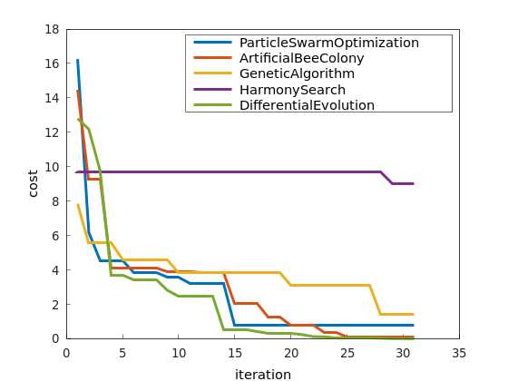
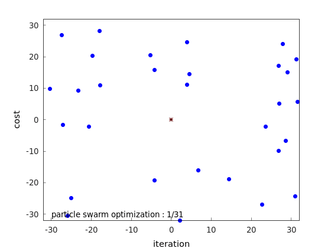
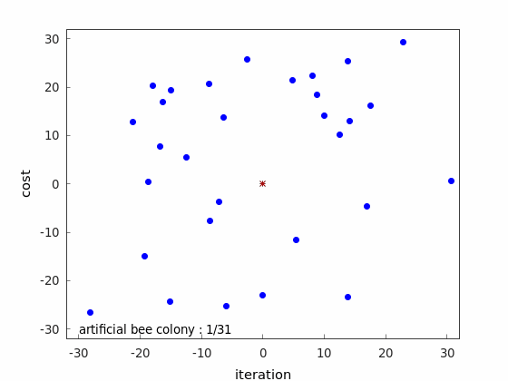
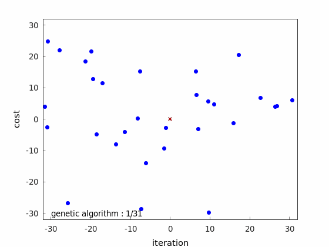
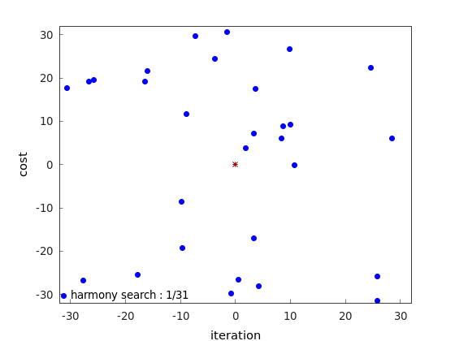
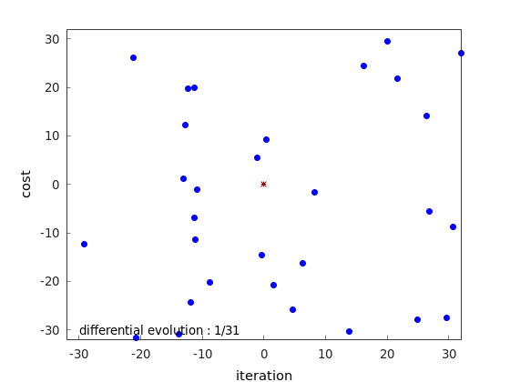

# metaheuristics_optimization

[](https://github.com/TakumaNakao/metaheuristics_optimization/actions/workflows/build.yml)

## What is this?
Demonstration of meta-heuristics algorithms.

## Dependencies
* CMake
* Eigen3
* Matplot++

## Docker
Launch Docker with the following command:
```
bash docker_bringup.sh
```

## Build
build
```
bash build.sh
```
clean build
```
bash clean_build.sh
```

## Minimize Ackley Function


### Particle Swarm Optimization


### Artificial Bee Colony


### Genetic Algorithm


### Harmony Search


### Differential Evolution


## References
* https://qiita.com/pocokhc/items/07b698cc426cadb3a64e